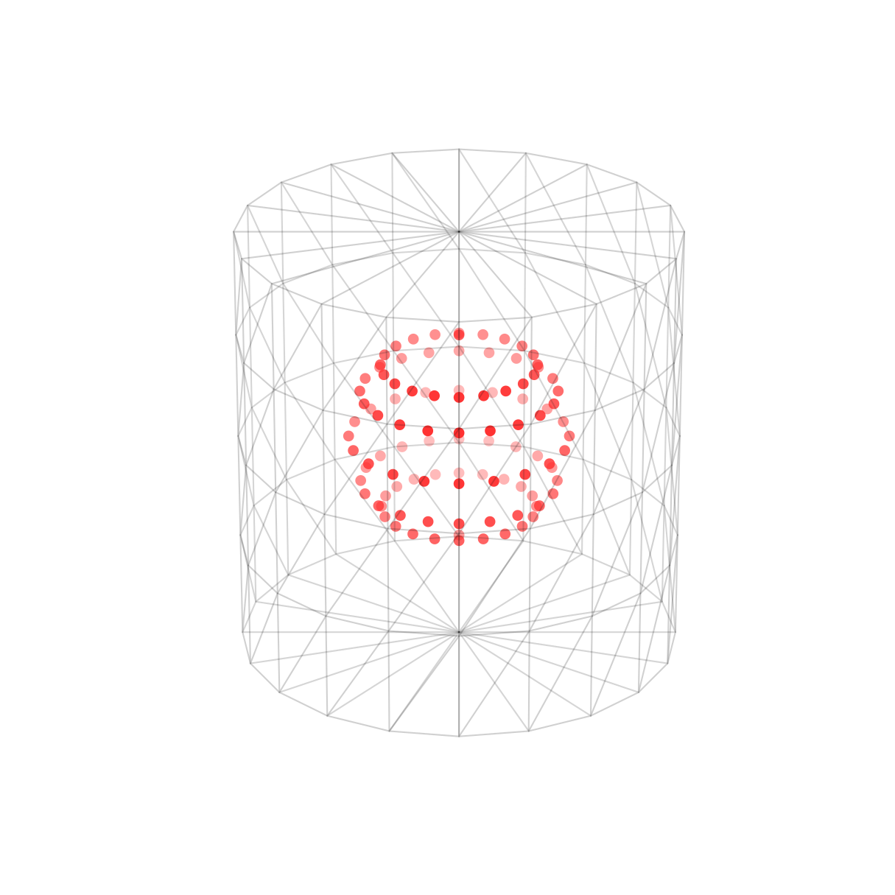
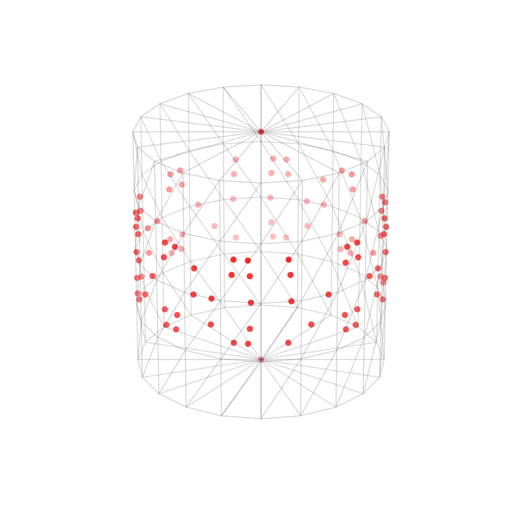
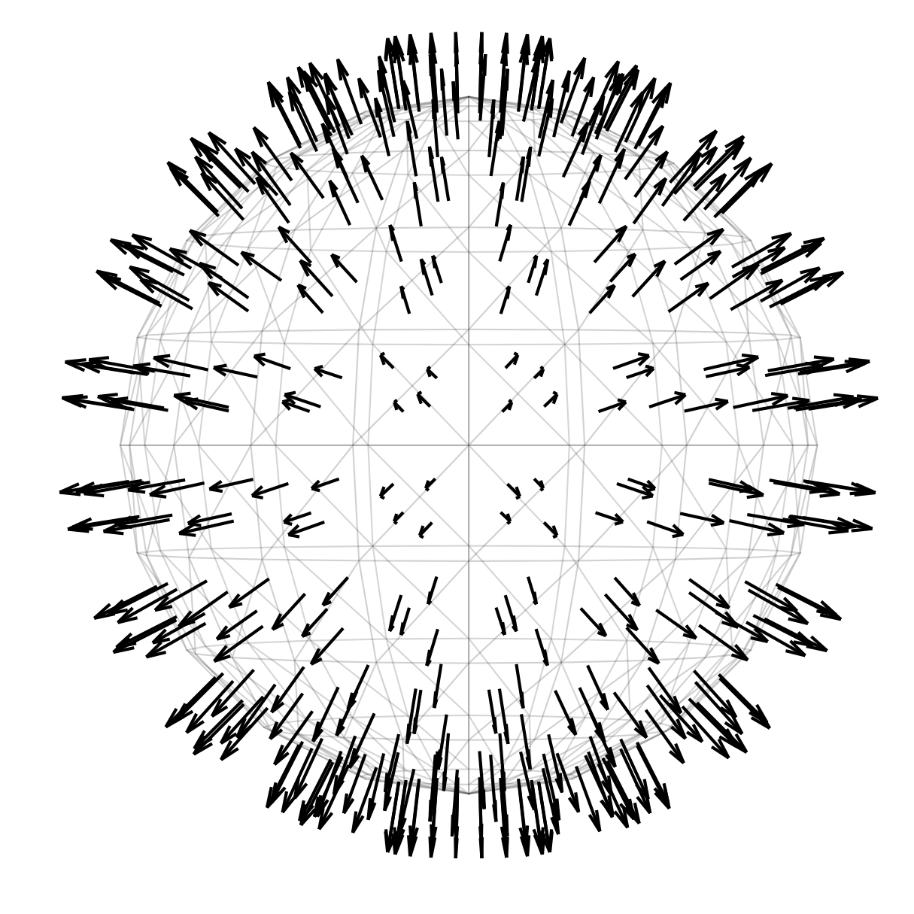

# Geometric Tools

Some basic geometric operations like projections and coordinates conversions.

#### compute_inner_sphere()

Compute parameters of a sphere which is inner of a point cloud given. The *center* is obtained through the geometry coordinates and the *radius* is the maximum possible to be enclosed by the point cloud.

#### project_to_sphere()

Project a point cloud to a sphere based on centre and radius parameters. In this example, the centre and radius of the sphere were computed with ```compute_inner_sphere()``` and the radius was divided by two



#### project_to_surface()

Project a point cloud to a surface. In this example, the red inner sphere of above was projected to the triangle mesh. The implementation use RaycastingScene (open3d).



#### cartesian_to_spherical_coords()
#### spherical_to_cartesian_coords()

A classic methods to convert coordinates from cartesian to spherical and *vice versa*.

#### compute_triangle_barycenters()
#### compute_triangle_normals()

These methods allow computing the barycenters and normals of a mesh.


